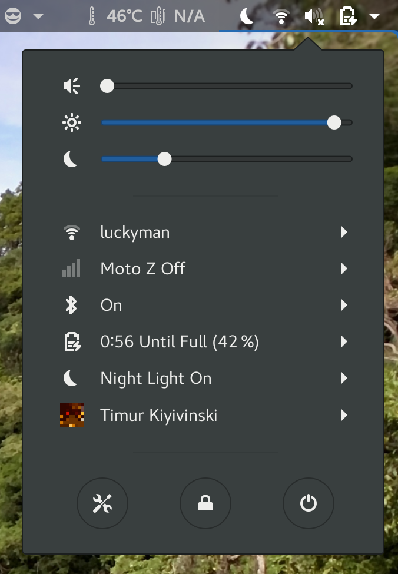

# gnome night light slider extension
Manage GNOME night light temperature intensity from the panel

It currently supports a minimum temperature of `1000` and a maximum of `10000`

# installation
Available from GNOME extensions website [here](https://extensions.gnome.org/extension/1276/night-light-slider/)
