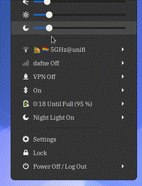
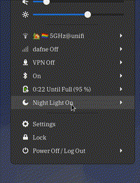
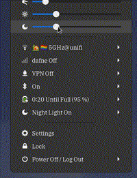
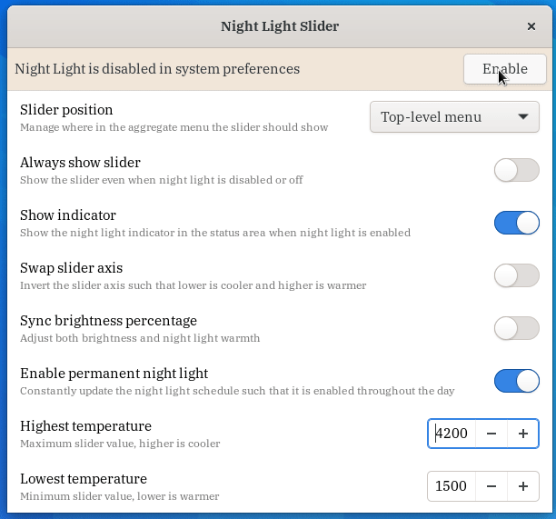

# gnome-night-light-slider-extension

Manage GNOME's built-in night light temperature intensity from the aggregate menu!

- Click or scroll the slider to change the Night Light temperature
- Scroll on the indicator to change the Night Light temperature
- The preference panel even supports a quick toggle to enable Night Light if it's disabled!

## preferences

The extension can be customized with the following preferences:

- Change the slider position in the aggregate menu, either at the top-level or in the Night Light submenu
- Always have the slider shown, even when the Night Light is disabled
- Toggle the indicator visibility
- Swap the axis of the slider
- Sync Night Light slider percentage with brightness (albeit not vice-versa, works well on laptops with well tuned temperature ranges)
- Enable permanent Night Light via having a timer constantly shift and update the Night Light schedule
- Adjust minimum and maximum temperature values

## installation

Available from GNOME extensions website [here](https://extensions.gnome.org/extension/1276/night-light-slider/), make sure to enable Night Light under Settings/Display

## contributors

- [@protopopov1122](https://github.com/protopopov1122) [#46](https://github.com/kiyui/gnome-shell-night-light-slider-extension/pull/46) [#49](https://github.com/kiyui/gnome-shell-night-light-slider-extension/pull/49)
- [@themightydeity](https://github.com/themightydeity) [#58](https://github.com/kiyui/gnome-shell-night-light-slider-extension/pull/58)
