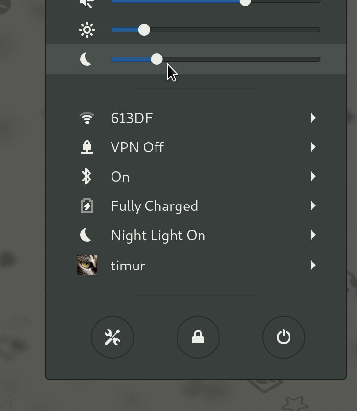

# gnome-night-light-slider-extension
Manage GNOME's built-in night light temperature intensity from the panel

## installation
Available from GNOME extensions website [here](https://extensions.gnome.org/extension/1276/night-light-slider/), make sure to enable Night Light under Settings/Display

## contributors
- [@protopopov1122](https://github.com/protopopov1122) [#46](https://github.com/TimurKiyivinski/gnome-shell-night-light-slider-extension/pull/46)
