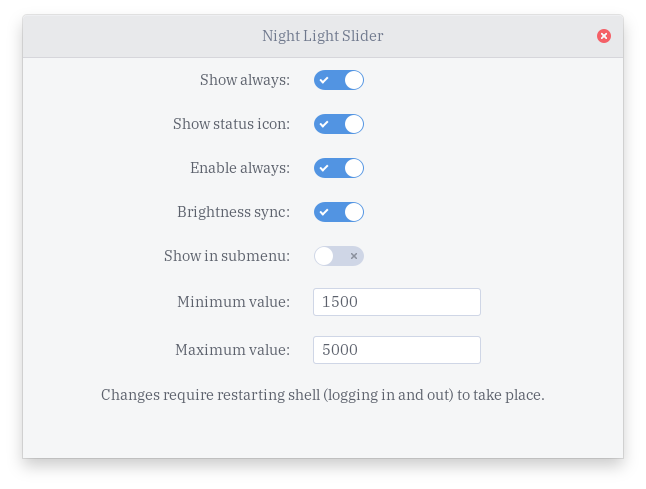

# gnome-night-light-slider-extension

Manage GNOME's built-in night light temperature intensity from the panel

## options

The extension has many configuration options, such as:

- Having the night slider show at all times, even when the night light is disabled
- Disabling the status icon from showing
- Having the extension enable night light throughout the day
  - Enabling this will mess up your night light time settings because it periodically changes the night light schedule to keep it enabled all day
- Letting the night light automatically sync with your screen brightness
  - This feature only makes sense on some laptops
- Toggling the extension to appear in the night light submenu instead

## installation

Available from GNOME extensions website [here](https://extensions.gnome.org/extension/1276/night-light-slider/), make sure to enable Night Light under Settings/Display

## contributors

- [@protopopov1122](https://github.com/protopopov1122) [#46](https://github.com/kiyui/gnome-shell-night-light-slider-extension/pull/46) [#49](https://github.com/kiyui/gnome-shell-night-light-slider-extension/pull/49)
- [@themightydeity](https://github.com/themightydeity) [#58](https://github.com/kiyui/gnome-shell-night-light-slider-extension/pull/58)
